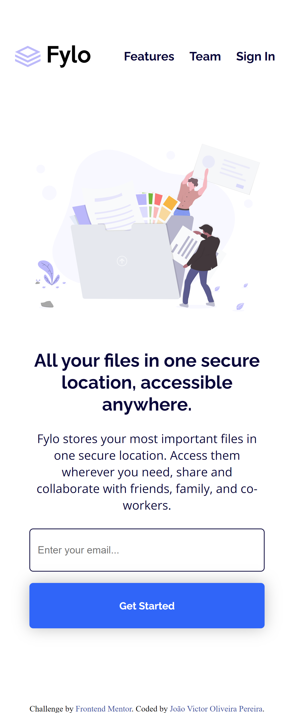
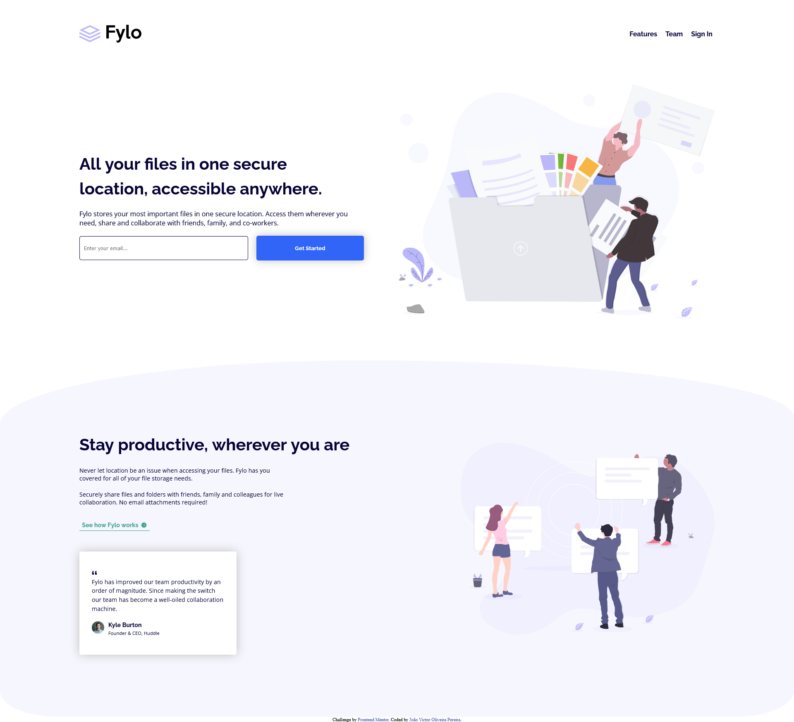
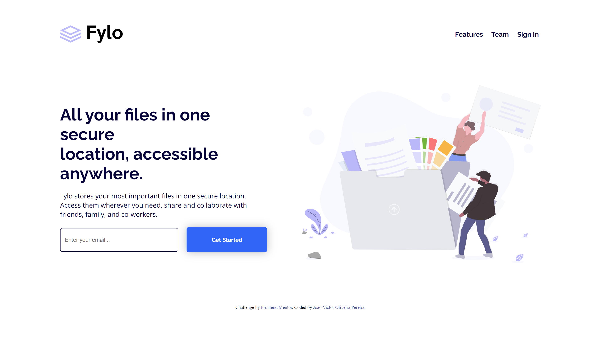

# Fylo landing page with two column layout

## Autores

- [@joaoquinto](https://github.com/joaoquinto)

## Aprendizados

### O que você aprendeu construindo esse projeto?

- O pré-processador chamado stylus

### Quais desafios você enfrentou?

- Nunca ter usado um pré-processador css

### Como você superou-os?

- Estudando
- Pesquisando
- Testando
- Lendo documentação

## Screenshots

### Mobile Screenshot

### Desktop Screenshot

## Stack utilizada

- Front-end: HTML5, CSS3, stylus

- Ferramentas: Google Fonts, , Vscode, Git, Github, Google Lighthouse

- Monitoramento: Google Analytics
